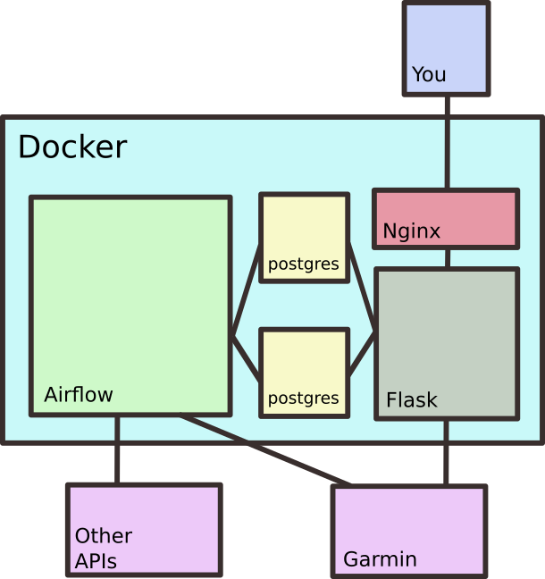

# FiresideSat

## About

FiresideSat is a tool to send wildfire and AQI data to your (Garmin)
satellite phone. 

The program's tasks are divided into directed acyclic graphs
(DAGs) that are managed by Apache Airflow. The main tasks involve
adding and managing data in a postgreSQL database and sending reports
based on those data to the user's phone. 

You can add users and trips through the UI, which is accessible on
your browser at localhost:3000. 

## Architecture

## Installation

* Install [Docker](https://docs.docker.com/engine/install/).
* Get an api key from
[airnow.gov](https://docs.airnowapi.org/account/request/).
* Clone this repository.
* `cd` into FirsideSat and run `docker-compose build`

## Usage

Coming soon

  
